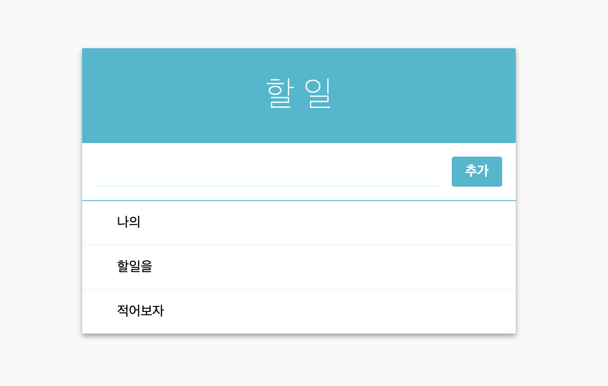

# 리액트로 만드는 Todo list 

[demo](https://my-app-yesjean.vercel.app/)



# start!!

리액트앱 만들기
```
yarn global add create-react-app
```

프로젝트 생성하기
```
create-react-app todo-list
```

프로젝트 실행
```
yarn start
```

### 1. 컴포넌트 구성하기

1. TodoTemplate
    - 템플릿 역할 
2. Form
    - 인풋과 버튼이 담겨있음
3. TodoItemList
    - TodoItem 컴포넌트 여러개를 렌더링 해주는 역할
    - Template를 만들었기때문에 따로 스타일링 할건 없다. 
4. TodoItem

### 2. 상태관리

Form과 TodoList는 상태관리가 필요하다.

### 3. 컴포넌트 최적화

컴포넌트 라이프 사이클 메소드중 shouldComponentUpdate 는 컴포넌트가 리렌더링을 할 지 말지 정해줌
이게 따로 구현되지 않으면 언제나 true 를 반환하는데, 이를 구현하는 경우에는 업데이트에 영향을 끼치는 조건을 return 해주면 된다.
